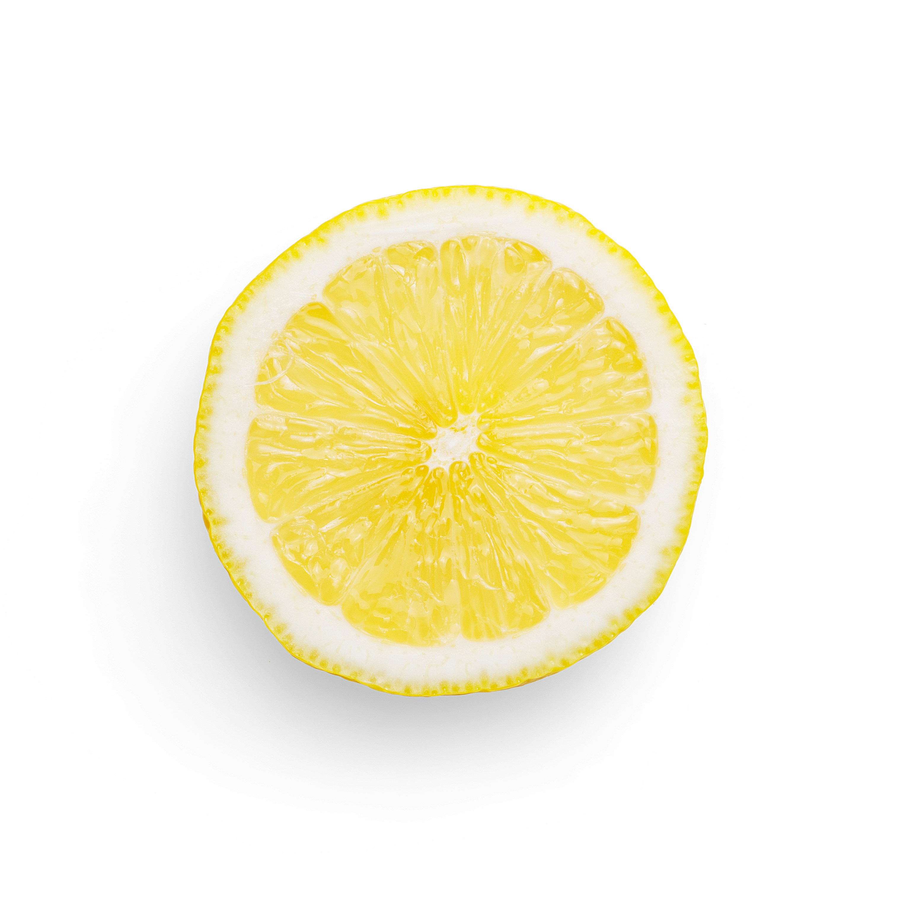

<p align="center">
  
</p>

# Citrus
Citrus is a statically typed loosely functional language with an emphasis on concurrency inspired by languages including Rust, Gleam, Ocaml, Bend, Odin. 
## Examples
```
alias string = [int];
extern printstr: fn(string): unit;
let main = fn() {
  printstr("hello world");
}
```
```
alias string = [int];
extern printstr: fn(string): unit;
extern printint: fn(int): unit;
type struct = {
	hello: int,
	world: bool
};
type enum = [
	hello,
	world
];
alias my_alias = enum;
let const = 5;
let add = fn(a: int, b: int): int {
	a+b
};
let main = fn() {
	let handle = add(1, 2);  
	printstr("Hello world");  
	printint(5+5);  
	if const < 3 {   
		printstr("math broke")  
	} else {   
		printstr("Its fine")  
	};  
	printint(handle); 
};
```

## Usage
To install the citrus compiler first install cargo (rust's package manager) and then run `cargo install --git https://github.com/creggegg/citrus`
Now the citrus compiler is installed on your machine. To create your first program make a file with the ending .ct and paste in the hello world example. Now you can run either `citrus run <file>.ct` or `citrus build <file>.ct`. Either way the produced executable can be found in the out folder in the directory you ran the command from.
